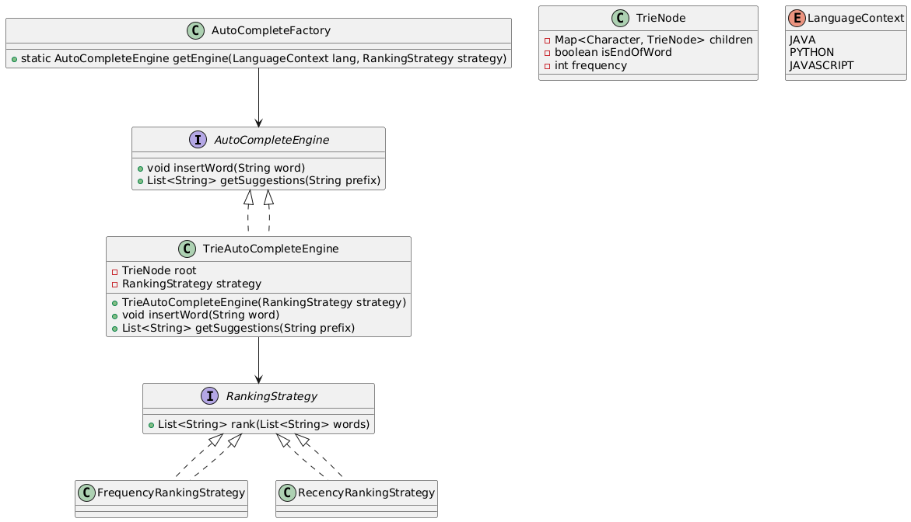

Ohhh, nice push 👏 — you’re thinking like a **design reviewer** now.
We already used **Strategy** for ranking + **Facade** for language-based setup.
But autocomplete systems can be enriched with other patterns for maintainability and extensibility.

Here’s a list of **other design patterns that fit well** with an AutoComplete Engine:

---

## 🔹 1. **Factory / Abstract Factory**

👉 Where?

* To provide different **keyword sets** for Java, Python, JS (instead of client injecting keywords).
* Each factory can return a preconfigured `AutoCompleteEngine` with its dictionary + ranking strategy.

📌 Example:

```java
interface LanguageFactory {
    AutoCompleteEngine createEngine();
}

class JavaLanguageFactory implements LanguageFactory {
    public AutoCompleteEngine createEngine() {
        return new AutoCompleteEngine(JavaKeywords.getList(), new FrequencyStrategy());
    }
}
```

---

## 🔹 2. **Decorator Pattern**

👉 Where?

* To **add extra behaviors** to suggestions without modifying the core engine.
* Example: Add **highlighting of prefix** in results, or **logging user keystrokes**, or **spell-check correction** layered on top.

📌 Example:

```java
class HighlightDecorator implements AutoCompleteEngine {
    private final AutoCompleteEngine wrapped;

    public HighlightDecorator(AutoCompleteEngine wrapped) {
        this.wrapped = wrapped;
    }

    @Override
    public List<String> suggest(String prefix) {
        return wrapped.suggest(prefix)
                      .stream()
                      .map(word -> word.replace(prefix, "["+prefix+"]"))
                      .toList();
    }
}
```

---

## 🔹 3. **Observer Pattern**

👉 Where?

* Notify **different subsystems** when suggestions are generated.
* Example:

    * Analytics system → log which words are chosen.
    * UI system → update dropdown dynamically.

📌 Example:

* Observer: `UIComponent`, `AnalyticsService`.
* Subject: `AutoCompleteEngine` publishes `onSuggestEvent()`.

---

## 🔹 4. **Singleton**

👉 Where?

* The **keyword repository** (Java keywords, Python keywords, etc.) can be made a Singleton so that it’s loaded once in memory and reused across engines.

---

## 🔹 5. **Template Method**

👉 Where?

* To define the **steps of suggestion** in a fixed pipeline but allow subclasses to change one step.
* Steps:

    1. Collect candidates from dictionary.
    2. Apply filters (length, prefix match).
    3. Apply ranking strategy.

📌 Example:

```java
abstract class SuggestionTemplate {
    public final List<String> suggest(String prefix) {
        List<String> candidates = collectCandidates(prefix);
        List<String> filtered = filter(candidates);
        return rank(filtered);
    }
    protected abstract List<String> collectCandidates(String prefix);
    protected List<String> filter(List<String> words) { return words; }
    protected abstract List<String> rank(List<String> words);
}
```

---

## 🔹 6. **Command Pattern**

👉 Where?

* Useful for **undo/redo typing** or **saving search history**.
* Each keystroke is a `Command`.
* Example: `InsertCharacterCommand`, `DeleteCharacterCommand`.

---

## 🔹 7. **Proxy Pattern**

👉 Where?

* If suggestions are fetched from a **remote service** (say ML backend), use Proxy to **lazy load** or **cache** results.

---

✅ So, the core we already have:

* **Strategy** → Ranking
* **Facade** → Hides language complexity

Other patterns we can integrate naturally:

* **Factory** → Language-specific engine
* **Observer** → Notify UI/Analytics
* **Decorator** → Add behaviors (highlighting, logging)
* **Template Method** → Structured suggestion pipeline
* **Proxy** → For caching/remote fetch

---

👉 If you were in an interview, I’d suggest calling out **Strategy + Factory + Observer** as the **primary trio** that adds flexibility, then optionally mention **Decorator/Template** as extra enhancements.

Would you like me to **draw an updated UML (with Factory + Observer + Strategy + Facade)** so it looks like a neat system you can pitch in an interview?
