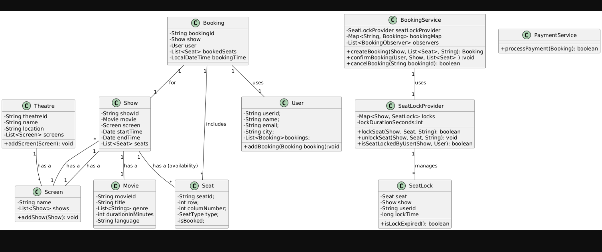

Perfect! Let's design the **BookMyShow system** from the ground up — just the **class structure and relationships** for now, assuming **single-threaded environment** (so we can ignore concurrency and seat locking for now).

---

## 🎯 Goal

Design a system like **BookMyShow** that allows:

* Browsing movies and theatres
* Seeing showtimes
* Selecting seats
* Booking tickets
* Cancelling bookings

---

### ✅ 8. `BookingService` class

Handles the logic of seat selection, availability check, and booking.

```java
import model.Booking;
import model.Seat;
import model.Show;
import model.User;

class BookingService {
    public Booking bookSeats(User user, Show show, List<Seat> requestedSeats) {
        // logic to check availability and create Booking
    }

    public boolean cancelBooking(String bookingId) {
        // logic to cancel
    }
}
```

✅ `BookingService` **USES** `Show`, `Seat`, and `Booking`

---

### ✅ 9. Enums

```java
enum BookingStatus {
    BOOKED, CANCELLED, PAYMENT_FAILED
}
```

---

## ✅ UML-like Class Diagram (Text-Based)

```
User
 └── HAS-A → List<Booking>

Booking
 ├── HAS-A → User
 ├── HAS-A → Show
 └── HAS-A → List<Seat>

Theatre
 ├── HAS-A → List<Screen>
 └── HAS-A → Location (city)

Screen
 └── HAS-A → List<Show>

Show
 ├── HAS-A → Movie
 ├── HAS-A → List<Seat>
 └── HAS-A → Screen

Seat
 └── HAS-A → SeatType (Enum)

BookingService
 └── USES → Booking, Show, Seat
```

---

## ✅ Real-World Analogy

> You (User) go to PVR (Theatre) in Bangalore, watch **Jawan** (Movie) on **Screen 2** at 7 PM (Show), and book **seats A1, A2** (Seats), then you get a **booking receipt** (Booking).

---

Great! Let’s now level up your BookMyShow system and **scale it for 10 million DAU (Daily Active Users)**.

We’ll break it down step-by-step in the **easiest possible way**, so even if you're new to HLD, you’ll understand:

---

## 🌍 Real-World Problem

You now have:

* 10M+ users opening your app daily
* Users searching, selecting seats, booking, paying at the same time
* You need high availability, low latency, and NO double bookings

---

## 🧱 Step-by-Step: High-Level Architecture Components

```
        +-----------------------------+
        |     Load Balancer (ELB)     |
        +-----------------------------+
                  /       |      \
                 /        |       \
       +--------+  +------------+  +-----------+
       | Search |  | BookingSvc |  | PaymentSvc|
       +--------+  +------------+  +-----------+
            \              |               |
             \             v               v
            +-------------------+     +--------------+
            |  Seat Inventory DB|     | Payment API  |
            +-------------------+     +--------------+
                    |
          +---------------------+
          | Redis (Seat Locks)  |
          +---------------------+
                    |
          +---------------------+
          | Event Queue (Kafka) |
          +---------------------+
```

---

## 1️⃣ Entry Point: **Load Balancer**

* Accepts user traffic and distributes it across services (auto-scaled)
* Helps in **horizontal scaling** (e.g., AWS ELB, NGINX)

---

## 2️⃣ Service Layer: **Microservices**

| Service                 | Responsibilities                                 |
| ----------------------- | ------------------------------------------------ |
| **SearchService**       | Search movies, shows, locations                  |
| **BookingService**      | Lock seats, confirm bookings, handle concurrency |
| **UserService**         | User login, preferences                          |
| **NotificationService** | Send email/SMS                                   |
| **PaymentService**      | Integrate Razorpay, Stripe, etc.                 |
| **AnalyticsService**    | Tracks events, impressions, views                |

**Why microservices?**

* **Separation of concerns**
* Easier to **scale independently** (Booking vs Search)
* Team-wise ownership possible

---

## 3️⃣ Database Layer

| Data Type             | DB Type                               | Reason                       |
| --------------------- | ------------------------------------- | ---------------------------- |
| Movie Info, Shows     | **SQL (e.g., Postgres, MySQL)**       | Structured relationships     |
| Bookings              | **SQL (ACID required)**               | Atomic updates for ticketing |
| Users & Preferences   | **NoSQL (MongoDB, Cassandra)**        | Fast access, schema-flexible |
| Seat Lock State       | **Redis / Memcached**                 | Fast, in-memory, TTL support |
| Logs, Events, Metrics | **Time Series (Elastic, Prometheus)** | For monitoring               |

---

## 4️⃣ Seat Locking — 🔐 Redis to the Rescue

| Feature     | Why Redis?                            |
| ----------- | ------------------------------------- |
| Speed       | Extremely fast (in-memory)            |
| Locking TTL | We can set `expire` in 2 minutes      |
| Atomic ops  | `SETNX`, `EXPIRE` to avoid race cond. |

**Example**

```bash
SETNX seat:show1:A1 user1  # Only user1 can lock if free
EXPIRE seat:show1:A1 120   # Auto release after 2 min
```

---

## 5️⃣ Messaging — 📬 Kafka/RabbitMQ (Event Queue)

Why?

* Async **notifications**, **analytics**, and **retries**
* Prevents tight coupling between services

Use case:

* Booking confirmed → send message → NotificationService picks up and sends SMS

---

## 6️⃣ CDN + Caching

| What              | Tool               | Why                             |
| ----------------- | ------------------ | ------------------------------- |
| Static content    | CloudFront, Akamai | For logos, images               |
| Movie show cache  | Redis / CDN        | Reduce DB hit for popular shows |
| Seat availability | Redis              | Fast and real-time visibility   |

---

## 7️⃣ Scalability Strategies

| Technique                   | Purpose                                |
| --------------------------- | -------------------------------------- |
| **Horizontal Scaling**      | Add more servers (BookingService x 10) |
| **Read Replicas**           | Handle search/read load on DB          |
| **Sharding**                | Split DB by city/region                |
| **Caching**                 | Avoid hitting DB on every request      |
| **Asynchronous processing** | For email, notifications               |
| **Idempotency Keys**        | Avoid duplicate payments/bookings      |

---

## 8️⃣ High Availability & Resilience

* **Retry logic** on client and service side
* **Idempotency** in BookingService (so duplicate retry won't double book)
* **Timeouts** + **Circuit Breakers** using Resilience4J
* Auto-restart using **Kubernetes + Liveness probes**

---

## 9️⃣ Monitoring & Observability

| Tool                     | What It Does                |
| ------------------------ | --------------------------- |
| **Grafana + Prometheus** | Monitor service health, QPS |
| **ELK Stack (Elastic)**  | View logs                   |
| **Jaeger/Zipkin**        | Distributed tracing         |

---

## ✅ Final Summary

| Component           | Tech Used                    |
| ------------------- | ---------------------------- |
| Service Layer       | Microservices, Spring Boot   |
| Caching             | Redis, Memcached             |
| Databases           | SQL + NoSQL combo            |
| Concurrency Control | Redis + TTL + SETNX          |
| Communication       | Kafka (events)               |
| Scale               | Load balancer + auto-scaling |
| Reliability         | Idempotency + retries        |

---

### 🎓 What's Next?

Would you like me to:

1. 🧠 Create a component-wise HLD diagram?
2. 📦 Help design BookingService as a microservice with APIs?
3. 📊 Show database schema and sharding strategies?

Let’s keep going step by step to master this.
Absolutely! Let’s simulate a **System Design Interview** scenario for **BookMyShow**, where I’ll act as the interviewer (an experienced system design engineer) and also provide you with **expected ideal answers** explained **simply** and **descriptively**, using analogies and real-world references where helpful.

---

## ✅ Core System Design Questions for BookMyShow

---

### 🔹 **Q1. What are the main components or services you'd include in your BookMyShow system?**

> 🎯 **Answer**:
> We can break the system into multiple logical components:

1. **User Service** – manages login, signup, profile, preferences.
2. **Movie Service** – stores movie metadata like title, duration, language, cast.
3. **Theatre Service** – stores information about theatres, their screens and locations.
4. **Show Service** – links movies with theatres and times (i.e., "RRR at PVR at 7PM").
5. **Booking Service** – handles seat selection, ticketing, and booking lifecycle.
6. **Payment Service** – integrates with payment gateways and handles transactions.
7. **Seat Locking Service** – ensures users don’t double-book the same seat.
8. **Notification Service** – sends SMS/email after booking.
9. **Search Service** – enables location-based or genre-based movie search.

🧠 *Fancy Word: “Modularization”* – means breaking down a big monolithic system into smaller, independently scalable components.

---

### 🔹 **Q2. How would you design the seat booking system to avoid race conditions?**

> 🎯 **Answer**:
> To avoid race conditions (when two users try to book the same seat at the same time), I’d introduce a **Seat Locking Service**.

* When a user selects seats, the system locks them temporarily (e.g., for 5 minutes).
* If payment is successful, the seat is confirmed and locked permanently.
* If payment fails or times out, the lock expires and the seat is released.

💡 I'd use **in-memory data stores** like **Redis** to manage locks because they’re:

* Fast (low latency)
* Ephemeral (expire automatically)
* Scalable

🧠 *Fancy Word: “Optimistic Locking”* – assuming conflict is rare, but detecting it and recovering if needed.

---

### 🔹 **Q3. The system needs to support 10M DAUs. How would you scale it?**

> 🎯 **Answer**:
> To handle 10 million Daily Active Users (DAUs), I'd focus on:

#### ✅ 1. **Horizontal Scaling**

* Deploy services across multiple servers.
* Load balancer to distribute traffic.

#### ✅ 2. **Database Sharding**

* Split large tables (like bookings, shows) based on city, theatre, or movie ID.

#### ✅ 3. **Caching**

* Cache frequently accessed data: movies, shows, seat maps using Redis or Memcached.

#### ✅ 4. **Queueing for Async Tasks**

* Use Kafka/RabbitMQ for background jobs: email, SMS, payment confirmation.

🧠 *Fancy Word: “Elastic Scalability”* – the system should automatically scale up/down based on load.

---

### 🔹 **Q4. What database(s) would you use and why?**

> 🎯 **Answer**:

| Data Type                 | DB Choice                            | Reason                        |
| ------------------------- | ------------------------------------ | ----------------------------- |
| Movies, Users, Bookings   | **Relational DB (PostgreSQL/MySQL)** | Need ACID, joins, consistency |
| User Preferences, Reviews | **NoSQL (MongoDB)**                  | Flexible schema               |
| Seat Locking              | **Redis**                            | In-memory, fast TTL           |
| Logs, analytics           | **Elasticsearch / Cassandra**        | Write-heavy, time-series      |

🧠 *Fancy Word: “Polyglot Persistence”* – using multiple types of databases for different needs.

---

### 🔹 **Q5. How would you ensure reliability if payment fails but the seat is already locked?**

> 🎯 **Answer**:
> Use **Idempotent APIs** and transactional behavior:

* Lock seat → Start payment → On success, confirm booking.
* If payment fails, don’t confirm booking; just let the seat lock expire.

To be safe:

* Use a **transactional outbox pattern** or **saga pattern**.
* Maintain **booking status**: `PENDING`, `CONFIRMED`, `CANCELLED`.

🧠 *Fancy Word: “Idempotency”* – Same operation can be retried multiple times without side effects.

---

### 🔹 **Q6. How would you support global expansion (multiple countries, timezones)?**

> 🎯 **Answer**:

* Store all times in **UTC** and convert to local at the UI level.
* Use **region-based service separation**: e.g., APAC region has its own cluster.
* Support multiple currencies & languages using **i18n (internationalization)**.

🧠 *Fancy Word: “Geo-partitioning”* – Split users/data based on their geographical region.

---

### 🔹 **Q7. How would you design the notification system (email, SMS)?**

> 🎯 **Answer**:

* Event-driven architecture using Kafka/SQS.
* Once booking is done, send an event `BOOKING_CONFIRMED`.
* Notification service listens and sends SMS/email.

Use a retry mechanism for failures and send async to keep booking fast.

🧠 *Fancy Word: “Eventual Consistency”* – It’s okay if the notification is slightly delayed but eventually sent.

---

### 🔹 **Q8. How would you make the search fast (by movie, location, etc.)?**

> 🎯 **Answer**:

* Use **Elasticsearch** or **Solr** for full-text, fuzzy, and location-based searches.
* Sync Elasticsearch from main DB using async pipelines.

🧠 *Fancy Word: “Search Indexing”* – Precomputing and organizing data in a way that makes searching super fast.

---

### 🔹 **Q9. How would you test this system (components, performance)?**

> 🎯 **Answer**:

* Unit tests for each service (user, booking, etc.)
* Integration tests for booking flow
* Load tests using JMeter or Gatling
* Chaos testing to simulate failures (Netflix-style)

🧠 *Fancy Word: “Test Pyramid”* – Unit > Integration > End-to-End

---

### 🔹 **Q10. Bonus: How would you version your APIs?**

> 🎯 **Answer**:

* Use URL versioning like `/api/v1/bookings`
* Deprecate older versions with proper lifecycle
* Make backward-compatible changes when possible

🧠 *Fancy Word: “Backward Compatibility”* – Ensuring existing clients don’t break on updates.

---

## 💡 Final Tip (if you're being interviewed):

Always explain with:

* Real-world analogies
* Diagrams (if asked)
* Trade-offs (“I’d choose X over Y because…”)
* Mentioning failure cases and recoveries shows deep understanding

---

Would you like a PDF-style compiled interview prep sheet of BookMyShow system design questions + answers? Or a whiteboard sketch walkthrough of the components?
