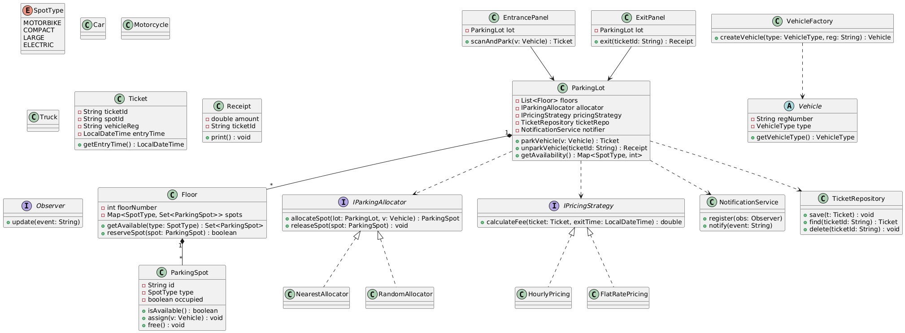

Nice — let’s do this cleanly and get you interview-ready.

Below I’ll:

1. List **primary requirements** (functional + non-functional).
2. Propose a **clean OO design** with responsibilities and chosen design patterns (and why).
3. Give a **UML (PlantUML)** diagram you can paste into any PlantUML viewer.
4. Describe key classes, interfaces, and important behaviors (sequence for “park a vehicle”).

After this you’ll be ready to ask me to implement the core parts (I can produce Java code next).

---

# 1) Primary requirements

## Functional (must-have)

* Add vehicles entering the parking lot and assign them a spot (Park).
* Release a parked vehicle (Unpark) and compute fee.
* Query available spots / occupancy per floor / per spot type.
* Support different vehicle types (Motorcycle, Car, Truck) and multiple spot sizes.
* Support reservations (optional/simple).
* Issue and validate parking tickets (ticket id, entry time, spot).
* Support prioritized allocation rules (handicapped/EV/compact preference).

## Non-functional / constraints

* Thread-safe (concurrent entries/exits).
* Extensible (new spot types, pricing strategies, allocation strategies).
* Simple persistence (tickets/history) for audit and billing.
* Low-latency allocation (should be O(1) or O(log n) ideally).
* Observability: publish events (occupancy change / full lot / alert).

---

# 2) High-level design decisions & patterns

* **Primary data structure**: Each floor holds pools / priority structures (e.g., `TreeSet` or `PriorityQueue`) per spot type for fast allocation.
* **SOLID**:

    * S: Each class has single responsibility (Spot, Vehicle, Ticket, Payment, Allocator).
    * O: Add new allocation or pricing strategies without modifying core logic (`Allocator` and `PricingStrategy` interfaces).
    * L: Subtypes of `Vehicle` and `Spot` follow Liskov — replaceable.
    * I: Clients depend on small focused interfaces (`IParkingLot`, `IParkingAllocator`).
    * D: High-level code depends on abstractions (strategy interfaces), not concrete allocators.
* **Design Patterns**:

    * **Singleton** — `ParkingLotManager` or `ParkingLot` (single logical lot instance).
    * **Factory** — `VehicleFactory` / `SpotFactory` to create different types.
    * **Strategy** — `ParkingSpotAllocator` (Nearest, FirstFit, ReservedFirst), `PricingStrategy` (flat, hourly).
    * **Observer / Pub-Sub** — `NotificationService` to notify admins / users when lot is full or events occur.
    * **Command (optional)** — for actions (ParkCommand, UnparkCommand) to support queueing/retries.
    * **DAO/Repository** — for persistence of tickets/history.

---

# 3) UML (PlantUML) — paste into PlantUML tool

---

# 4) Key classes & responsibilities (summary)

### `ParkingLot` (Facade / Singleton)

* Responsibilities: orchestrates park/unpark operations, delegates spot selection to `IParkingAllocator`, applies pricing, persists tickets, emits events.
* Methods: `parkVehicle(Vehicle)`, `unparkVehicle(ticketId)`, `getAvailability()`.

### `Floor`

* Holds the physical spots, keeps per-SpotType structures for fast lookup (e.g., `TreeSet` ordered by spot id or distance).
* Thread-safe operations to mark spot occupied/free.

### `ParkingSpot`

* Holds `id`, `SpotType`, `occupied` flag, metadata (isEV, distanceFromEntrance maybe).

### `Vehicle` (abstract) and concrete `Car`, `Motorcycle`, `Truck`

* Holds registration, optionally owner info, special flags (handicapped).

### `Ticket` / `TicketRepository`

* Ticket: issued at entry, used to unpark. Repository persists tickets and history.

### `IParkingAllocator` (Strategy)

* Implementations decide which `ParkingSpot` to choose:

    * `NearestAllocator` — choose spot closest to entrance.
    * `FirstFitAllocator` — first available spot by type.
    * `ReservedFirstAllocator` — reserve certain spots for VIP/Handicapped.

### `IPricingStrategy`

* Implementations: `HourlyPricing` (base+per-hour), `FlatRatePricing`, `GracePeriodPricing`.

### `EntrancePanel` / `ExitPanel`

* Lightweight UI/API that calls `ParkingLot`. The Entrance uses `VehicleFactory` to create `Vehicle` objects.

### `NotificationService` (Observer)

* Admins/UI can subscribe to occupancy/full events. Optionally notify users (SMS/email).

---

# 5) Sequence: Park a vehicle (simplified)

1. User arrives at `EntrancePanel.scanAndPark(vehicleInfo)`.
2. `EntrancePanel` creates `Vehicle` via `VehicleFactory`.
3. `EntrancePanel` calls `ParkingLot.parkVehicle(vehicle)`.
4. `ParkingLot` calls `allocator.allocateSpot(this, vehicle)` to get a `ParkingSpot`.
5. If spot available:

    * mark `ParkingSpot.assign(vehicle)` (atomic operation).
    * create `Ticket` (ticketId, entryTime, spotId, vehicle).
    * persist via `TicketRepository.save(ticket)`.
    * notify observers via `NotificationService.notify(Event.PARKED)`.
    * return `Ticket` to entrance/user.
6. If none available:

    * optionally add to waitlist or return failure.

---

# 6) Concurrency & performance notes

* **Locking granularity**: synchronize at `ParkingSpot` or per-SpotType pool rather than at whole lot to increase throughput.
* Use `ConcurrentHashMap`, `ConcurrentLinkedQueue` or `PriorityBlockingQueue` for thread-safe pools.
* Use optimistic locking or `compareAndSet` for spot allocation to avoid double-assignments.
* For large lots, partitioning by floor / entrance reduces contention.

---

# 7) Persistence & replay

* Store tickets and occupancy events in durable repo (RDBMS/NoSQL). Use idempotent writes and event sourcing if you want full audit.
* On restart, restore spot states from persisted active tickets.

---

# 8) Extensibility examples (how SOLID + patterns help)

* New pricing model? Add new class implementing `IPricingStrategy` — no change to `ParkingLot`.
* New allocation rule? Add a new `IParkingAllocator`.
* Add EV charging spots? Add `SpotType.ELECTRIC` and possibly `ChargingSpot` subclass.

---

# Next step

I can now **implement the above** in Java (core classes only) with:

* Thread-safe `Park`/`Unpark` logic,
* One allocator (Nearest) and one pricing strategy (Hourly),
* Simple in-memory `TicketRepository`,
* A small `main()` to demo.

Would you like me to implement the core Java code now? If yes, I’ll provide complete, well-documented code (with concurrency safeguards and unit-testable methods).
