# Introduction to Object-Oriented Design

Below is an article that contains the necessary details for an introduction to object-oriented design. The UML diagrams have been prepared using [Mermaid](https://github.com/mermaid-js/mermaid).

# Contents

1. [Introduction to Object-Oriented Design](#introduction-to-object-oriented-design)
    - [1.1. Definition](#11-definition)
    - [1.2. Difference Between Object-Oriented Design and Object-Oriented Programming](#12-difference-between-object-oriented-design-and-object-oriented-programming)

2. [Core Concepts in OOD](#2-core-concepts-in-ood)
    - [2.1. Class, Interface and Abstract Class](#21-class-interface-and-abstract-class)
    - [2.2. Coupling and Cohesion](#22-coupling-and-cohesion)
    - [2.3. The Four Pillars of OOD](#23-the-four-pillars-of-ood)

3. [Difference Between Interface and Abstract Class](#3-difference-between-interface-and-abstract-class)

4. [UML Cheat-Sheet](#4-plus--uml-cheat-sheet)
    - [4.1. Basic Syntax](#41-basic-syntax)
        - [4.1.1 Class Definition](#411-class-definition)
        - [4.1.2 Abstract Class Definition](#412-abstract-class-definition)
        - [4.1.3. Interface Definition](#413-interface-definition)
    - [4.2. Relationships](#42-relationships)
        - [4.2.1. Class - Class (Inheritance)](#421-class---class-inheritance)
        - [4.2.2. 4.2.2. Class - Interface (Implementation)](#422-class---interface-implementation)
        - [4.2.3. Abstract Class-Class (Inheritance)](#423-abstract-class-class-inheritance)
    - [4.3. Association](#43-association)
        - [4.3.1. Bidirectional](#431-bidirectional)
        - [4.3.2. Unidirectional](#432-unidirectional)
        - [4.3.3. Aggregation](#433-aggregation-has-a-relationship)
        - [4.3.4. Composition](#434-composition-stronger-has-a-relationship)
        - [4.3.5. Dependency](#435-dependency)

## 1. What is Object-Oriented Design?

### 1.1. Definition
Object-Oriented Design (OOD) involves strategically planning how objects in software will interact to address specific programming challenges. It's about structuring your software using objects that have specific roles and responsibilities.

### 1.2. Difference Between Object-Oriented Design and Object-Oriented Programming
Object-Oriented Design (OOD) and Object-Oriented Programming (OOP) are closely related but distinct concepts. While OOD focuses on the architectural planning of a software system using objects, OOP involves implementing these designs in code. Simply using object-oriented languages and their features like classes and inheritance doesn't guarantee effective OOD. Good design is essential for creating robust and maintainable software.

## 2. Core Concepts in OOD

### 2.1. Class, Interface and Abstract Class
- **Class** A class in object-oriented programming is a blueprint from which individual objects are created. It encapsulates data for the object and methods to manipulate that data. Classes define the properties (data) and behaviors (methods) that their instances (objects) will have.

- **Interface** An interface is a programming structure that defines the methods a class must implement, without providing the implementation itself. Interfaces are used to establish a formal contract that a class agrees to uphold, which means any class that implements the interface agrees to implement all its methods as specified.

- **Abstract Class** An abstract class is a class that cannot be instantiated on its own and must be inherited by other classes. It can include abstract methods (which have no body) that must be implemented by derived classes, as well as concrete methods (which have implementations). This allows abstract classes to define template methods and partial implementations where applicable.

| **Feature**         | **Class**                                                        | **Interface**                                                        | **Abstract Class**                                                 |
|---------------------|------------------------------------------------------------------|----------------------------------------------------------------------|--------------------------------------------------------------------|
| **Instantiation**   | Can be instantiated directly if it has a constructor.            | Cannot be instantiated directly.                                     | Cannot be instantiated directly.                                   |
| **Implementation**  | Contains both data and method implementations.                  | Cannot contain any method implementations.                          | Can contain both abstract and concrete methods.                    |
| **Inheritance**     | Can inherit from another class (single inheritance).             | Can inherit multiple interfaces.                                     | Can be inherited but cannot inherit multiple classes.              |
| **Methods**         | Can have full method definitions.                                | Only contains method signatures (no bodies).                         | Can have both abstract methods and full methods.                   |
| **Usage**           | Used to create detailed, fully-functional objects.               | Used to specify a contract that implementing classes must follow.    | Used as a base class with partial implementation to share among multiple derived classes. |


### 2.2. Coupling and Cohesion
- **Coupling** describes how dependent classes or modules are on each other. Lower coupling is preferable because it means that changes in one area of the software have minimal impact on other parts, making the system easier to manage and evolve.

- **Cohesion** measures how closely the elements within a single module or class work together to achieve a common goal. A highly cohesive class focuses on a single task, enhancing understandability and reducing complexity.

High coupling combined with low cohesion often leads to fragile and difficult-to-maintain systems. Conversely, striving for low coupling and high cohesion makes software easier to manage, test, and expand.

### 2.3. The Four Pillars of OOD
These principles guide developers in creating flexible, reusable, and maintainable software.

- **Abstraction** allows you to use a class without understanding its intricate details, much like driving a car without knowing the mechanics of its operation. Abstraction helps to reduce complexity and enhance the focus on interaction rather than implementation.

  > **Design Tip:** Keep class members as private or protected as possible to maintain flexibility and cleanliness in your code.

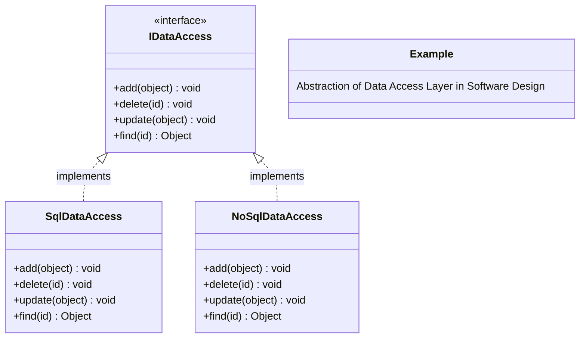

- **Encapsulation**, or data hiding, involves bundling the operations (methods) and data (attributes) of a class together and restricting access to some components. This protects the data and reduces the effects of change.

  > **Design Tip:** Limit visibility to ensure that class internals are exposed only when necessary, which enhances both security and usability.

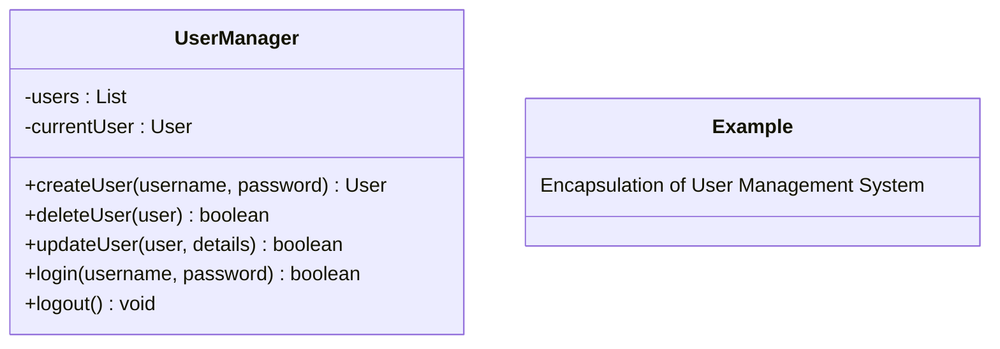

- **Inheritance** creates a hierarchical relationship between classes, allowing derived classes to inherit features from their base classes, promoting code reuse and reducing redundancy.

  > **Design Tip:** Utilize base classes for common attributes or methods and use protected access to ensure that these are available to subclassed objects.

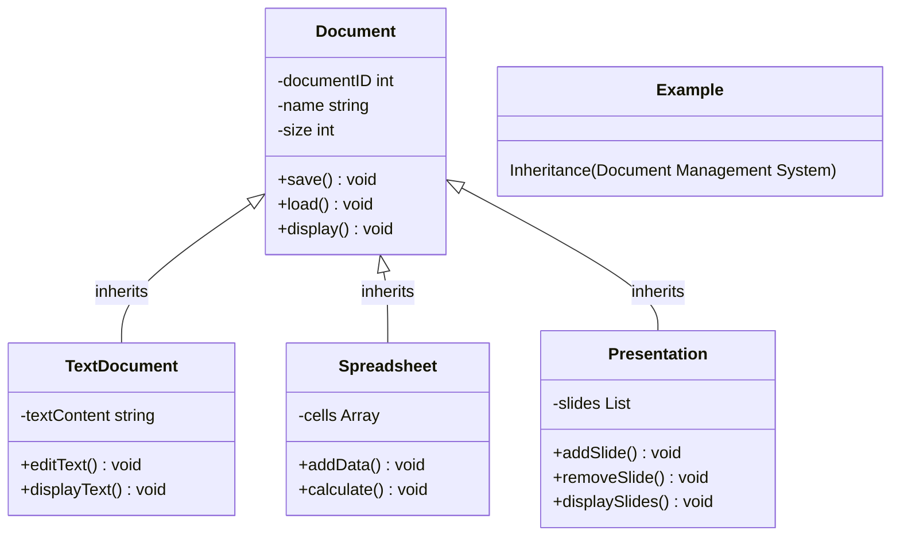

- **Polymorphism** allows objects to be treated as instances of their parent class, making it possible to use subclasses interchangeably with their base class. This capability is critical for creating flexible and dynamically adaptable software.

  > **Design Tip:** Spend time carefully assigning roles and responsibilities to classes to leverage polymorphism effectively.

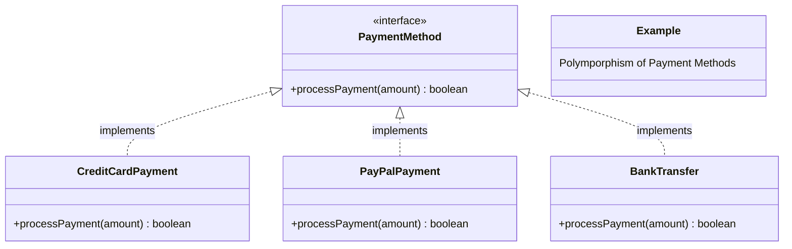

With these principles in mind, developers can build software that is robust, easy to maintain, and scalable. Object-oriented design is not just about using specific tools or languages; it's a way of thinking about and structuring your software to address complex problems with efficient solutions.

## 3. Difference Between Interface and Abstract Class
| **Feature**              | **Interface**                                                                                    | **Abstract Class**                                                                         |
|--------------------------|--------------------------------------------------------------------------------------------------|--------------------------------------------------------------------------------------------|
| **Main Purpose**         | To define a contract that other classes must follow without providing any method bodies.         | To provide a partial implementation of a class which other classes can build upon.         |
| **Method Implementation**| Cannot contain any implemented methods (traditionally), only method signatures. Modern languages like Java 8+ allow default methods in interfaces. | Can contain both fully implemented (concrete) methods and abstract methods that must be implemented by subclasses. |
| **State Storage**        | Cannot hold state (no instance fields). Interfaces define behaviors, not state.                 | Can hold state with instance fields and thus can define both state and behavior.            |
| **Constructor**          | Cannot have constructors because interfaces cannot be instantiated on their own.                 | Can have constructors which can be invoked by subclass constructors.                        |
| **Inheritance**          | A class can implement multiple interfaces, allowing for more flexible design via multiple inheritance of behavior. | A class can only inherit from one abstract class (in languages like Java and C#), restricting flexibility but allowing more comprehensive behavior sharing. |
| **Accessibility Modifiers** | Members of an interface are implicitly public (in most languages).                              | Members can have varying levels of accessibility (public, protected, private).              |
| **Use Cases**            | **Example:** A `PaymentProcessor` interface with a `processPayment` method can be implemented by different classes like `CreditCardProcessor`, `PayPalProcessor`, etc. This ensures that all payment processors follow the same procedure for processing payments. | **Example:** An abstract class `Animal` might contain method implementations like `eat` or `sleep` and abstract methods like `makeSound`. Classes like `Dog` and `Cat` would inherit from `Animal` and implement the `makeSound` method to specify how each animal species sounds. |


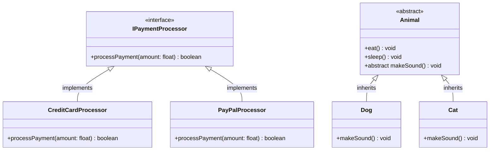

# 4. Plus : UML Cheat-Sheet Using Mermaid

A comprehensive guide to designing UML diagrams in Markdown using Mermaid. This cheat-sheet covers the syntax for creating classes, interfaces, abstract classes, and the relationships between them.

## 4.1. Basic Syntax

### 4.1.1. Class Definition
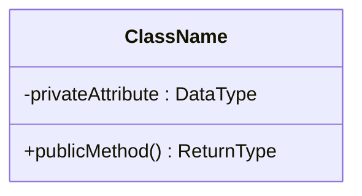

```
classDiagram
    class ClassName {
      -privateAttribute : DataType
      +publicMethod() ReturnType
    }
```


### 4.1.2. Abstract Class Definition
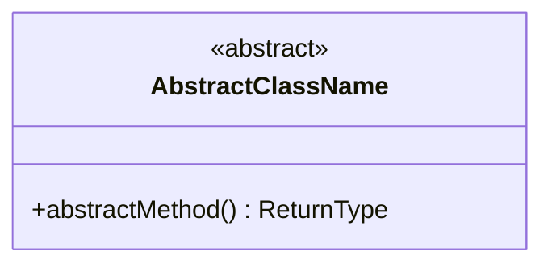

```
classDiagram
    class AbstractClassName{
        <<abstract>>
        +abstractMethod() ReturnType
    }
```


### 4.1.3. Interface Definition
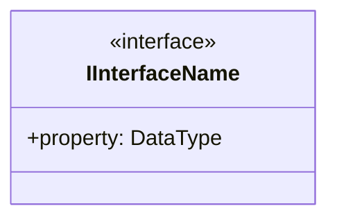

```
classDiagram
    class IInterfaceName{
        <<interface>>
        +property: DataType
    }
```


## 4.2. Relationships

### 4.2.1. Class - Class (Inheritance)
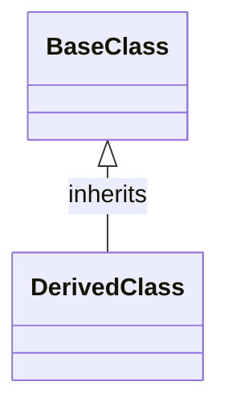

```
classDiagram
    BaseClass <|-- DerivedClass : inherits
```


### 4.2.2. Class - Interface (Implementation)
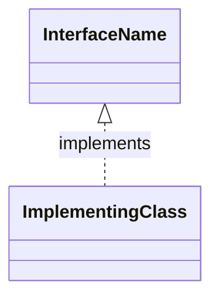

```
classDiagram
    InterfaceName <|.. ImplementingClass : implements
```

### 4.2.3. Abstract Class-Class (Inheritance)
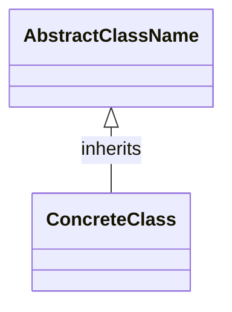

```
classDiagram
    AbstractClassName <|-- ConcreteClass : inherits
```


## 4.3. Association

### 4.3.1. Bidirectional
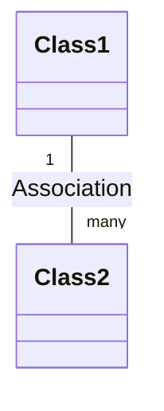

```
classDiagram
    Class1 "1" -- "many" Class2 : Association
```

### 4.3.2. Unidirectional
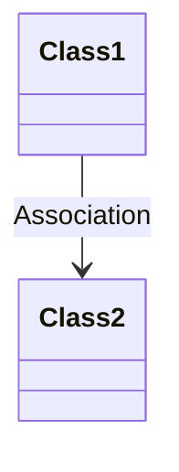

```
classDiagram
    Class1 --> Class2 : Association
```

### 4.3.3. Aggregation (Has-A Relationship)
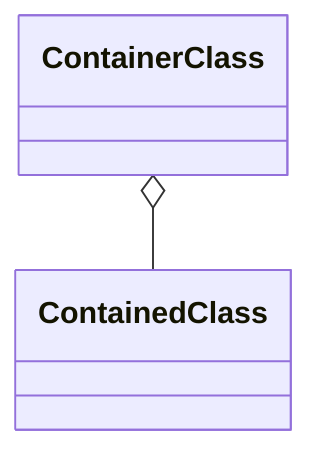

```
classDiagram
    ContainerClass o-- ContainedClass
```

### 4.3.4. Composition (Stronger Has-A Relationship)
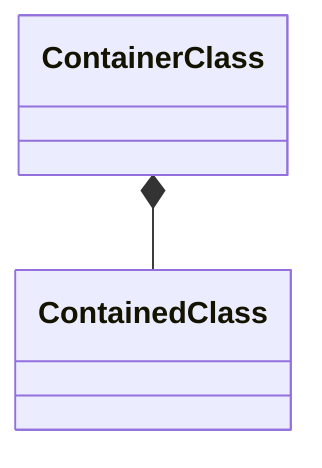

```
classDiagram
    ContainerClass *-- ContainedClass
```

### 4.3.5. Dependency
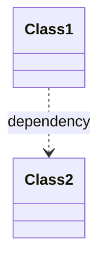

```
classDiagram
    Class1 ..> Class2 : dependency
```

## Conclusion
In conclusion, Object-Oriented Design (OOD) offers a powerful approach to software development, enabling the creation of modular, reusable, and maintainable code. By modeling systems as collections of objects that interact with each other, OOD promotes encapsulation, inheritance, and polymorphism, facilitating the design of robust and flexible systems.